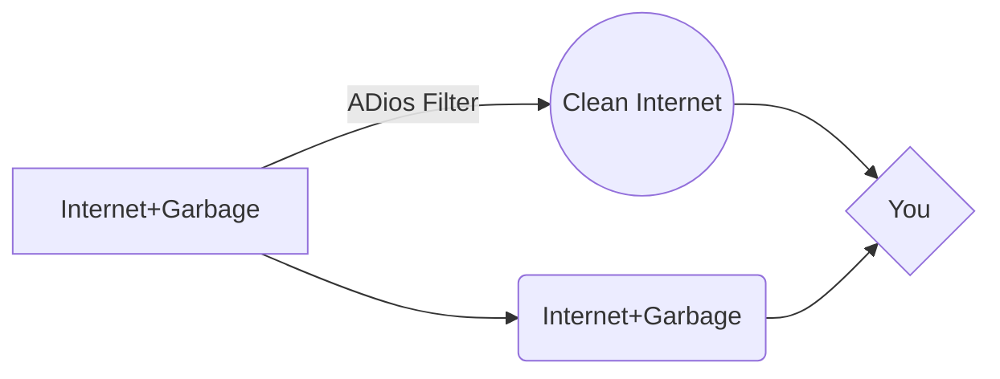

# ADios!
## The ultimate adblocker
***Last Update: 2019/January/16***

[DOWNLOAD](https://github.com/AlexRabbit/ADios-ADS/archive/master.zip)

[RAW TEXT](https://raw.githubusercontent.com/AlexRabbit/ADios-ADS/master/hosts)


This repository is a compilation of several reputable `hosts` files, and merges them into a unified host file with duplicates removed. 
I use a notepad++ plugin that deletes repetitive lines so this entries are Unique.

# Features
-   **It blocks:** strictly blocks *`advertisements, malwares, spam, statistics, trackersAds,Adware, Gambling, Dead Sites, Scammer Sites, ADS in Software, Microsoft tracking, crypto mining`* 
- **Compatible** with all devices, regardless of OS. on web browsing, applications and any mobile device.
-   **privacy:** with all these annoyances blocking, it also `increases` privacy.
- *THIS HOST BLOCKER DOESNT HAVE REPETITIVE LINES - ALL LINES ARE IN 0.0.0.0*

> This blocks the AD servers in the internet going to your computer, 
> that means when you enter a website Ex: youtube, you conect to youtube
> and their ad servers like ADSENSE, this will block ADSservers requests
> and  you only will enjoy pure internet.


## What. Is. This.
A hosts file is a local file stored on the computer that translates domain names into an IP addresses.
When looking up an IP address, the computer will **first look at the hosts file** to resolve the name. If the name is in the local hosts file as not allowed, you cannot access the site.. So here is the *hack* intead of blocking sites, it only blockes the ADS

Example - the following entry **0.0.0.0** **ad.doubleclick.net** blocks all files supplied by that [DoubleClick](http://en.wikipedia.org/wiki/Doubleclick "Wikipedia Definition of Doubleclick") Server to the web page you are viewing. This also prevents the server from tracking your movements. Why? ... because in certain cases "Ad Servers" like Doubleclick (and many others) will try silently to [open a separate connection](http://winhelp2002.mvps.org/doubleclick.gif "View screenshot of DoubleClick trying to open a seperate connection.") on the webpage you are viewing, record your movements then yes ... follow you to additional sites you may visit.


***Make your choice..***



## How to install
### Automatically
- Simply locate the "***master.zip***" file you downloaded.  
- Highlight the file (single-click) then right-click and select > **Extract All** from the 
- **Next**: right-click the installer (***AUTOinstall.bat***) and select: **Run as Administrator** 
- "Ok" to the UAC prompt and the batch file will run ... which will backup the existing HOSTS file to HOSTS.MVP and copy the updated HOSTS file to the proper location automatically.
*and that's it ...*
### Manually
**On Windows**
* GO TO
```
HardDrive\windows\system32\drivers\etc\hosts
```
**On Linux**
* GO TO
```
HardDrive\etc\hosts
```
*Make a backup*:
- Grab the host file is already there
- right click and propeties
- remove "only read" and save
- now ove it to your desktop (do not change the name, its just make a back up)
```
Now you can Drag and drop my "host" file
```


### How to Uninstall
You need to delete the `host file` from the folder

I recomend [restarting your pc in safe mode](https://www.digitalcitizen.life/4-ways-boot-safe-mode-windows-10) (from msconfig) once in safe you can delete it. 

***or***

    Start > Run (type) "**services.msc**" (no quotes) Ok the prompt  
    Win8 users > Control Panel > Administrative Tools > Services  

- Scroll down to "**DNS Client**", 
- - Right-click and select: Properties  
- Click the drop-down arrow for "Startup type"  
- Select: **Automatic** then click Apply/Ok and restart. [[screenshot](http://winhelp2002.mvps.org/reset-dns.gif)]

***or***

-   From [sysinternals.com](https://docs.microsoft.com/en-us/sysinternals/) download the latest version of AUTORUNS ... it doesn't require installation.
-   Run autoruns64.exe as **ADMINISTRATOR** and wait until it finishes it's scan.
-   In the program menu under OPTIONS, uncheck the "**Hide Windows Entries**" option
-   Go to the Services tab, scroll down to the Dnscache entry and check the checkmark. [[screenshot](http://winhelp2002.mvps.org/autoruns.jpg)]

> ### Help, i dont have any backup!
You can simply delete the existing HOSTS file, then download the default Microsoft HOSTS file from here [[default hosts file.zip](http://winhelp2002.mvps.org/defaultwin7-hosts.zip)]

    Extract (unzip) and place the included HOSTS file in the default location.
