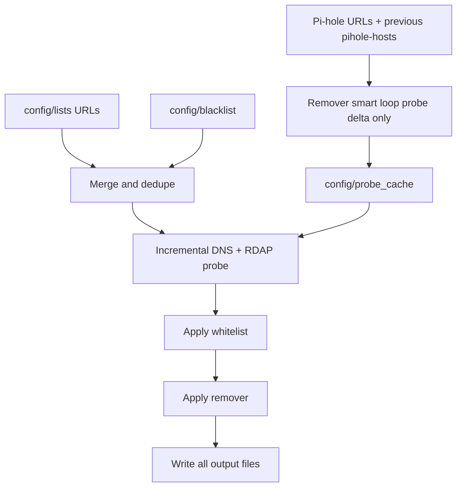

<div align="center">

# 👋 ADios — Say Goodbye to Ads

### *One blocklist. Every device. Zero nonsense.*

**by [AlexRabbit](https://github.com/AlexRabbit)**

[](LICENSE)
[](#-github-actions-auto-update)
[](#-quick-start-windows--double-click-first)
[](#-compatibility-matrix)

**Block ads on Twitch, Spotify, YouTube, Samsung TV apps, and the wider web — using lists your devices already understand.**

<br>

</div>

---

## 🖱️ Quick Start (Windows) — **double-click first**

> **This is the fastest way to use ADios on Windows. Do this before anything else.**

| Step | Action |
|:----:|--------|
| 1️⃣ | **Install Python 3.9+** from [python.org](https://www.python.org/downloads/) — check ✅ **“Add Python to PATH”** during install |
| 2️⃣ | **Double-click `ADios.bat`** in this folder |
| 3️⃣ | Wait for the build to finish (DNS probing can take several minutes) |
| 4️⃣ | Use the generated files — especially **`hosts`** for your PC (see [Install on Windows](#-install-on-windows) below) |

**What `ADios.bat` does:** runs `config/build_hosts.py`, merges all blocklist sources, probes dead domains via **unfiltered public DNS** (never your modem/router DNS), applies whitelist + remover, and writes every output file in this folder.

```
Double-click ADios.bat  →  wait  →  copy hosts  →  ads blocked ✨
```

<details>
<summary>🍎 <b>macOS / Linux quick start</b></summary>

```bash
chmod +x ADios.sh    # once
./ADios.sh
```

Or directly: `python3 config/build_hosts.py`
</details>

---

## ✨ What is ADios?

**ADios** merges trusted community blocklists into **one maintained, deduplicated, alive-only domain list** — then ships it in every format you need.

| Feature | What it means for you |
|---------|------------------------|
| 🧹 **One pipeline** | AdAway, AdGuard, streaming lists, and more → single clean output |
| 🚫 **Whitelist** | Spotify / Twitch playback domains stay **unblocked** |
| 🗑️ **Remover** | Dead / expired domains stay **out** of every list (inverse whitelist) |
| 🔍 **Smart DNS probe** | Unfiltered public DoH + RDAP — **not** your LAN, modem, Pi-hole, or Google/Cloudflare |
| 🔄 **Auto-update** | GitHub Actions rebuilds & publishes every **48 hours** |
| 📂 **Multi-format** | `hosts`, Pi-hole, DNSCrypt, AdGuard — same domains, correct syntax |
| 🧩 **ADiosBlocker** | Separate browser filter list for AdGuard / uBlock (not DNS hosts) |

---

## Subscribe to ADiosBlocker

**ADiosBlocker** is a merged **browser adblock filter list** — cosmetic rules, scriptlets, and advanced syntax for extensions. It is **separate** from DNS host files (`hosts`, `adguardhosts.txt`); do not mix [`config/lists2`](config/lists2) into [`config/lists`](config/lists).

**Subscription URL** (paste into your adblocker):

```
https://raw.githubusercontent.com/AlexRabbit/ADios/master/ADiosBlocker
```

| App | How to subscribe |
|-----|------------------|
| **AdGuard** (extension or app) | Settings → **Filters** → **Custom filters** → **Add** → paste the URL above |
| **uBlock Origin** | Extension icon → **Dashboard** → **Filter lists** → **Import** → paste the URL |

Rebuild locally: `python3 config/build_adblock.py`

---

## 📁 Repository structure (what each file does)

```
ADios/
├── ADios.bat              ← 🖱️ WINDOWS: double-click this first
├── ADios.sh               ← macOS / Linux launcher
├── README.md              ← you are here
├── LICENSE                ← GPL-3.0 (AlexRabbit)
│
├── hosts                  ← 🪟 system hosts file entries (0.0.0.0 domain)
├── pihole-hosts           ← 🕳️ plain domains for Pi-hole gravity
├── dnscrypt-hosts         ← 🔐 DNSCrypt blocked_names (section per source)
├── adguardhosts.txt       ← 🛡️ AdGuard Home DNS blocklist (||domain^ syntax)
├── ADiosBlocker           ← 🧩 browser adblock filter (AdGuard / uBlock subscribe)
│
├── config/
│   ├── build_hosts.py     ← ⚙️ DNS/hosts build engine (Python 3.9+, no pip)
│   ├── build_adblock.py   ← 🧩 ADiosBlocker merge engine (filter rules)
│   ├── lists              ← URLs of remote **hosts** blocklists to merge
│   ├── lists2             ← URLs of **filter lists** for ADiosBlocker (NOT hosts)
│   ├── blacklist          ← your extra domains to block
│   ├── whitelist          ← domains that must NEVER be blocked
│   ├── remover            ← 🗑️ domains that must NEVER appear in outputs (dead/expired)
│   └── probe_cache        ← internal DNS probe state (auto-managed)
│
└── .github/workflows/
    └── update-hosts.yml   ← auto-rebuild every 48h on GitHub
```

**Safe to publish:** no API keys, tokens, or private paths — only public list URLs and blocklist data.

---

## 🔄 How the build works


```mermaid
flowchart TD
    A[config/lists URLs] --> B[Merge and dedupe]
    C[config/blacklist] --> B
    P[Pi-hole URLs + previous pihole-hosts] --> R[Remover smart loop probe delta only]
    R --> E[config/probe_cache]
    B --> D[Incremental DNS + RDAP probe]
    E --> D
    D --> F[Apply whitelist]
    F --> G[Apply remover]
    G --> H[Write all output files]
```

| Step | Detail |
|:----:|--------|
| 1️⃣ | Fetch every URL in [`config/lists`](config/lists) |
| 2️⃣ | Merge, dedupe, normalize hostnames |
| 3️⃣ | Probe liveness via **Control D, OpenDNS, LibreDNS, dnsforge.de** (HTTPS DoH — bypasses modem adblock) |
| 4️⃣ | Confirm dead candidates with **RDAP** (domain actually unregistered) |
| 5️⃣ | Subtract [`config/whitelist`](config/whitelist) — keep services working |
| 6️⃣ | Subtract [`config/remover`](config/remover) — drop dead / expired / manual removals |
| 7️⃣ | Write `hosts`, `pihole-hosts`, `dnscrypt-hosts`, `adguardhosts.txt` |

### 🗑️ Whitelist vs Remover (read this once)

| File | Analogy | Effect |
|------|---------|--------|
| `config/whitelist` | ✅ “Always allow” | Domain **never blocked**, even if it appears in source lists |
| `config/remover` | ❌ “Always drop” | Domain **never in output files**, even if it appears in source lists |

Example: `0--0.ml` is dead → lands in **`config/remover`** → excluded from **`hosts`**, **`pihole-hosts`**, etc. **Every run**, automatically.

### One list → four output files

The build produces **one final domain list**, then writes it in four formats. Whitelist, blacklist, and remover all apply **before** any file is written — there is no per-format filtering.

| Stage | What happens |
|-------|----------------|
| Remover loop | Fetch Pi-hole URLs from [`config/lists`](config/lists), compare to previous [`pihole-hosts`](pihole-hosts) + [`config/remover`](config/remover), probe **only new** domains |
| Merge | Every URL in `config/lists` **plus** [`config/blacklist`](config/blacklist) |
| Probe | Incremental DNS/RDAP — domains already in `pihole-hosts` are trusted (skip re-probe unless TTL due) |
| Remover | `config/remover` = auto-detected dead domains **union** any manual entries you added |
| Filter | `final = candidates − whitelist − remover` |
| Write | Same `final` list → `hosts`, `pihole-hosts`, `dnscrypt-hosts`, `adguardhosts.txt` |

**Smart loop:** Each run fetches the latest Pi-hole source list(s), diffs against your previous `pihole-hosts` output and existing `config/remover`, and only DNS-probes the delta. Domains already shipped in `pihole-hosts` are not re-fetched/re-probed every run unless their alive TTL expires (default 30 days). Remover still applies to **all four outputs** every build.

---

## 📥 Install on Windows

> Already built? (via `ADios.bat` or downloaded from GitHub) Skip to step 3.

| Step | Action |
|:----:|--------|
| 1️⃣ | Run **`ADios.bat`** (or download [`hosts`](https://raw.githubusercontent.com/AlexRabbit/ADios/master/hosts) from GitHub) |
| 2️⃣ | Open **`hosts`** in this folder → `Ctrl+A`, `Ctrl+C` |
| 3️⃣ | Open **Notepad as Administrator** → File → Open → `C:\Windows\System32\drivers\etc\` |
| 4️⃣ | Set file type to **All Files (*.*)** → open **`hosts`** |
| 5️⃣ | **Backup first** (copy to `hosts.backup`) |
| 6️⃣ | Scroll to bottom → paste → Save |
| 7️⃣ | Restart browser or flush DNS: `ipconfig /flushdns` |

---

## 📥 Install on macOS / Linux

```bash
# Backup
sudo cp /etc/hosts /etc/hosts.backup

# Append ADios list (from GitHub)
sudo sh -c 'curl -sL https://raw.githubusercontent.com/AlexRabbit/ADios/master/hosts >> /etc/hosts'

# Or use your local build
sudo sh -c 'cat hosts >> /etc/hosts'
```

---

## ✅ Compatibility matrix

| Tool | File | Raw URL |
|------|------|---------|
| 🪟 **Windows hosts** | [`hosts`](hosts) | `https://raw.githubusercontent.com/AlexRabbit/ADios/master/hosts` |
| 🕳️ **Pi-hole** | [`pihole-hosts`](pihole-hosts) | `https://raw.githubusercontent.com/AlexRabbit/ADios/master/pihole-hosts` |
| 🔐 **DNSCrypt-proxy** | [`dnscrypt-hosts`](dnscrypt-hosts) | Point `blocked_names_file` to this file |
| 🛡️ **AdGuard Home** (DNS) | [`adguardhosts.txt`](adguardhosts.txt) | Import as DNS blocklist |
| 🧩 **AdGuard / uBlock** (browser) | [`ADiosBlocker`](ADiosBlocker) | `https://raw.githubusercontent.com/AlexRabbit/ADios/master/ADiosBlocker` |
| 🗑️ **Remover audit** | [`config/remover`](config/remover) | Dead/expired domains excluded from all outputs |

---

## ⚙️ Advanced — manual build & environment

**Requirements:** Python **3.9+** only. No `pip`, no `requirements.txt`.

```bash
python3 config/build_hosts.py
python3 config/build_adblock.py
```

| Variable | Default | Purpose |
|----------|---------|---------|
| `SKIP_DNS_CHECK=1` | off | Fast local build — skip DNS probe |
| `DNS_WORKERS=64` | 64 | Parallel DNS threads |
| `DNS_MAX_PROBE=25000` | 25000 | Max domains probed per run |
| `VERIFIED_TTL_DAYS=30` | 30 | Re-check alive domains after N days |
| `DEAD_RECHECK_DAYS=90` | 90 | One re-check for dead; second fail → permanent |
| `DNS_PROBE_ENDPOINTS` | *(built-in)* | Comma-separated DoH URLs override |

**Example — quick rebuild without DNS:**
```bash
set SKIP_DNS_CHECK=1
ADios.bat
```

---

## 🤖 GitHub Actions auto-update

Workflow: [`.github/workflows/update-hosts.yml`](.github/workflows/update-hosts.yml)

| Setting | Value |
|---------|-------|
| Schedule | Every **48 hours** (UTC) |
| Manual run | GitHub → **Actions** → **Update hosts** → **Run workflow** |
| Commits | `hosts`, `pihole-hosts`, `dnscrypt-hosts`, `adguardhosts.txt`, `ADiosBlocker`, `config/remover`, `config/probe_cache` |

**First publish:** include the generated output files from your first `ADios.bat` run so users can download lists immediately. GitHub Actions will refresh them every 48h after that.

**Missing files?** The workflow **creates/updates** all outputs automatically. An empty `config/remover` is fine on first clone; the build fills it.

---

## 🛡️ What gets blocked

| Category | Examples |
|----------|----------|
| 📺 Ads & trackers | AdAway, AdGuard registry lists |
| 📡 Streaming ads | Twitch, YouTube (incl. Samsung TV), Spotify ad endpoints |
| 🦠 Malware / abuse | URLhaus & similar feeds in sources |
| 📧 Scam / spam | Community abuse lists |

Playback-critical domains are **whitelisted** — Spotify/Twitch should keep working. Broken service? Open an issue with the domain to whitelist.

---

## ❓ FAQ

<details>
<summary><b>🖱️ Do I need to run ADios.bat if I only download from GitHub?</b></summary>

**No.** If you pull pre-built files from this repo, copy `hosts` directly. Run `ADios.bat` only when **you** want to rebuild locally from latest sources + your custom whitelist/remover.
</details>

<details>
<summary><b>📡 Will my modem / Pi-hole break the DNS dead-check?</b></summary>

**No.** Probes use **direct HTTPS** to public DoH resolvers — your modem, router, or Pi-hole DNS is **never queried**. Local adblock cannot cause false “dead” results.
</details>

<details>
<summary><b>🗑️ Why is config/remover huge?</b></summary>

It lists ~100k+ domains that **used to appear** in upstream blocklists but are **dead or expired** — keeping them would bloat your blocklist with useless entries. The **smart loop** probes only new Pi-hole-list domains each run; remover is applied **every run** before writing all four output files.
</details>

<details>
<summary><b>🕳️ How does the remover smart loop work?</b></summary>

Each build **fetches the latest Pi-hole list URL(s)** from [`config/lists`](config/lists) (URLs containing `pi-hole`). It compares that fresh list to your previous [`pihole-hosts`](pihole-hosts) output and [`config/remover`](config/remover). Only **new** domains get DNS-probed — already-handled domains are skipped. Dead results land in `config/remover` and are excluded from all four output files. The full merge still pulls every source in `config/lists`; domains already in `pihole-hosts` skip re-probe unless their alive TTL (30 days) expires.
</details>

<details>
<summary><b>🔒 Is this safe to publish / fork?</b></summary>

Yes. No secrets in repo — only public URLs, plaintext lists, and AlexRabbit’s build script. Review `config/lists` for third-party sources you trust.
</details>

<details>
<summary><b>✏️ How do I add my own blocks or exceptions?</b></summary>

| Goal | Edit |
|------|------|
| Block extra domain | [`config/blacklist`](config/blacklist) |
| Never block a domain | [`config/whitelist`](config/whitelist) |
| Force-remove a domain | [`config/remover`](config/remover) |
| Add another source list | [`config/lists`](config/lists) — one URL per line |

Then double-click **`ADios.bat`** again.
</details>

---

## 📜 License & credits

- **Author:** [AlexRabbit](https://github.com/AlexRabbit) — **ADios**
- **License:** [GPL-3.0](LICENSE)
- **Sources:** Public community lists (AdAway, AdGuard Hostlists Registry, Steven Black derivatives, streaming community lists, etc.) — see [`config/lists`](config/lists). Upstream projects keep their own licenses.

---

<div align="center">

**👋 ADios, ads.**

*Built with care by **AlexRabbit** — one list, auto-updated, hosts-based blocking everywhere.*

⭐ Star the repo if ADios helps you.

</div>
