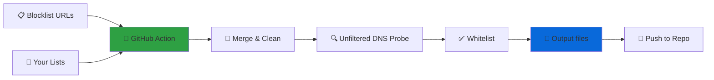

If this helped you, consider starring the repo ⭐

# 👋 ADios — Say Goodbye to Ads

### *The Ultimate Hosts-Based Blocklist. One List. Every Device. Zero Nonsense.*

 

**Block ads on Twitch, Spotify, YouTube, and pretty much everywhere else — using a simple list your computer already understands.**

*No apps to install. No subscriptions. Just copy, paste, and breathe easier.*

<!-- Optional: add a banner image to your repo (e.g. docs/banner.png) and uncomment:

-->

 

---

## ✨ What Is This? (In Plain English)

**ADios** is a **giant list of ad and tracker addresses** that your computer can use to **block them before they load**.

- 🧹 **One list** — We merge dozens of trusted blocklists (AdAway, Steven Black, AdGuard, and more) into a single, clean file.
- 🚫 **Whitelist included** — Important stuff (like making Spotify actually play music) is *not* blocked.
- 🔄 **Auto-updated every 48 hours** — GitHub Actions rebuilds the list and pushes it to this repo. You get fresh blocks without lifting a finger.
- 📂 **Standard format** — Works with your system **hosts file**, **Pi-hole**, **AdGuard**, **DNSMasq**, and similar tools.

You don’t need to be a nerd. You just need to copy one file to the right place. We’ll show you exactly where.

---

## 🔄 How It Works

```mermaid
flowchart LR
    A[📋 Blocklist URLs] --> B[🔄 GitHub Action]
    C[📄 Your Lists] --> B
    B --> D[🧹 Merge & Clean]
    D --> P[🔍 Unfiltered DNS Probe]
    P --> E[✅ Whitelist]
    E --> F[📁 Output files]
    F --> G[🚀 Push to Repo]
    style B fill:#2ea043
    style F fill:#0969da
```

| Step | What happens |
|------|----------------|
| 1️⃣ | Every 48 hours, GitHub Actions **fetches** all the blocklists we use. |
| 2️⃣ | It **merges** them, **removes duplicates**, and **cleans** the format. |
| 3️⃣ | It **probes dead domains** via unfiltered public DNS + RDAP/WHOIS (never your LAN, never Google/Cloudflare). |
| 4️⃣ | It **removes** whitelist domains (keep working) and **remover** domains (dead/expired — no longer a threat). |
| 5️⃣ | It writes **hosts**, **pihole-hosts**, **dnscrypt-hosts**, **adguardhosts.txt**, and **remover.txt**, then **pushes** to this repo. |
| 6️⃣ | You (or your Pi-hole, etc.) use those files. Ads and trackers get blocked. ✨ |

---

## 📥 Download & Install (Step by Step)

### 🪟 Windows

| Step | What to do |
|------|------------|
| **1** | Click this link to open the list: **[Download the hosts file](https://raw.githubusercontent.com/AlexRabbit/ADios/master/hosts)**. |
| **2** | Press `Ctrl + A` to select all, then `Ctrl + C` to copy. |
| **3** | Open **Notepad** *as Administrator* (right‑click Notepad → “Run as administrator”). |
| **4** | Go to **File → Open** and navigate to: `C:\Windows\System32\drivers\etc\` |
| **5** | In the file type dropdown, choose **“All Files (*.*)”** so you can see **hosts**. |
| **6** | Open **hosts**. **Make a backup first** (e.g. copy the file and name it `hosts.backup`). |
| **7** | Scroll to the **bottom** of the file. Paste the copied list there. Save and close. |
| **8** | Clear your browser cache (or restart the browser). Done! 🎉 |

> ⚠️ **Important:** Always keep a backup of your original **hosts** file. If something goes wrong, you can restore it.

### 🍎 macOS / 🐧 Linux

| Step | What to do |
|------|------------|
| **1** | Download: **[hosts file](https://raw.githubusercontent.com/AlexRabbit/ADios/master/hosts)** (right‑click → Save As, or copy the raw content). |
| **2** | Open **Terminal**. Back up your current hosts file: `sudo cp /etc/hosts /etc/hosts.backup` |
| **3** | Append the list to your hosts file (replace with your download path if needed):  
| | `sudo sh -c 'curl -sL https://raw.githubusercontent.com/AlexRabbit/ADios/master/hosts >> /etc/hosts'` |
| **4** | Or manually: open `/etc/hosts` in an editor with sudo, paste at the bottom, save. |
| **5** | Clear browser cache. Done! 🎉 |

---

## 🛡️ What Gets Blocked

| Category | What it means |
|----------|----------------|
| 📺 **Ads & trackers** | Common ad and analytics domains from the included lists. |
| 📡 **Streaming ads** | Twitch, YouTube (e.g. Samsung TV app), and similar ad domains. |
| 🎵 **In‑app ads** | Spotify, Deezer, and other in‑app ad endpoints where possible. |
| 🦠 **Malware & abuse** | Domains from URLhaus and similar abuse lists. |
| 📧 **Scam / spam** | Scam and spam domains from the included sources. |
| 🔞 **Adult ads** | Adult ad networks (not adult content itself). |

Whitelisted domains (e.g. core Spotify/Twitch domains needed for playback) are **removed** from the list so services keep working. ✅

---

## ✅ Compatibility

| Use case | What to use |
|----------|-------------|
| 🪟 **Windows / 🍎 macOS / 🐧 Linux** | [**hosts**](https://raw.githubusercontent.com/AlexRabbit/ADios/master/hosts) — copy into your system hosts file (see [Download & Install](#-download--install-step-by-step)). |
| 🕳️ **Pi-hole** | [**pihole-hosts**](https://raw.githubusercontent.com/AlexRabbit/ADios/master/pihole-hosts) — plain sorted domain list for gravity / adlist import. |
| 🔐 **DNSCrypt-proxy** | [**dnscrypt-hosts**](https://raw.githubusercontent.com/AlexRabbit/ADios/master/dnscrypt-hosts) — `blocked_names` file with section headers per source list (plain domain = blocks domain + subdomains). |
| 🛡️ **AdGuard / AdGuard Home** | [**adguardhosts.txt**](https://raw.githubusercontent.com/AlexRabbit/ADios/master/adguardhosts.txt) — `||domain^` syntax. Or use the **hosts** file URL. |
| 🗑️ **Remover list** | [**remover.txt**](https://raw.githubusercontent.com/AlexRabbit/ADios/master/remover.txt) — dead/expired domains stripped from all blocklists (inverse of whitelist). |

---

## ❓ FAQ

<b>🔄 How often is the list updated?</b>

**Every 48 hours.** The [Update hosts](.github/workflows/update-hosts.yml) workflow runs on a schedule (and can be triggered manually), rebuilds the list from all sources, and pushes **hosts**, **pihole-hosts**, **dnscrypt-hosts**, **adguardhosts.txt**, and **remover.txt** to this repo. You can re-download or re-pull the list anytime.

<b>🗑️ What is remover.txt / config/remover?</b>

**Remover is the opposite of whitelist.**

| File | Role |
|------|------|
| `config/whitelist` | Domains that must **never** be blocked (Spotify playback, etc.) |
| `config/remover` | Domains that must **never** appear in outputs — dead, expired, or manually dropped |

Every run, DNS probing finds domains like `0--0.ml` that no longer resolve and are unregistered. Those go into **`config/remover`** and the published **`remover.txt`**. The build subtracts remover **and** whitelist from the merged list before writing `hosts`, `pihole-hosts`, `dnscrypt-hosts`, and `adguardhosts.txt`.

You can also add domains manually to `config/remover` to force-remove them (same idea as editing whitelist).

<b>🔍 How are dead domains detected?</b>

The build script probes domains using **explicitly unfiltered public DNS-over-HTTPS** resolvers (Control D Unfiltered, OpenDNS, LibreDNS, dnsforge.de). It **never** uses your LAN/modem DNS, Google, or Cloudflare — probes go direct over HTTPS, bypassing local adblock.

- **Alive** if any resolver returns a DNS answer, or RDAP shows the domain is still registered.
- **Dead** only if ≥2 resolvers return NXDOMAIN for both A and AAAA **and** RDAP confirms the domain is unregistered/expired.
- **Inconclusive** results keep the domain (conservative — ad domains that fail DNS but still exist stay blocked).

State is stored in **`config/probe_cache`** (`alive`, `dead`, `dead_permanent`). First dead mark is re-checked after 90 days; if still dead, it becomes **permanent**. All removed domains are listed in **`config/remover`** and **`remover.txt`**.

Env overrides: `SKIP_DNS_CHECK=1`, `DNS_MAX_PROBE`, `VERIFIED_TTL_DAYS`, `DEAD_RECHECK_DAYS`, `DNS_PROBE_ENDPOINTS`.

<b>🚫 Will this break Spotify / Twitch / YouTube?</b>

We use a **whitelist** so that the domains those services need to work (playback, login, etc.) are *not* blocked. We only block **ad and tracking** domains. If something breaks, you can open an issue and we can add a domain to the whitelist.

<b>📁 Where is my hosts file?</b>

- **Windows:** `C:\Windows\System32\drivers\etc\hosts`  
- **macOS / Linux:** `/etc/hosts`  

Open it with a text editor (as Administrator on Windows, or with `sudo` on macOS/Linux).

<b>🔒 Is this safe?</b>

The list is built from well-known, community-maintained blocklists (AdAway, Steven Black, AdGuard, OISD, etc.). The build runs on GitHub’s servers and the result is plain text. You can inspect `config/build_hosts.py` and the source lists in `config/` (`lists`, `blacklist`, `whitelist`, `probe_cache`). On any machine with Python 3.9+, run `python3 config/build_hosts.py` — no pip or `requirements.txt` needed.

<b>📥 Do I need to update it myself?</b>

The **files on GitHub** update automatically every 48 hours. To get the latest list on *your* device, re-download or point your tool at the raw URLs (Pi-hole, DNSCrypt, system hosts).

---

## 📜 License & Thanks

- **License:** [GPL-3.0](LICENSE). Same for the build script and config; upstream lists keep their respective licenses.
- **Sources:** This list aggregates from public, community-maintained blocklists (AdAway, Steven Black, AdGuard, OISD, FadeMind, URLhaus, and others). See **config/lists** in the repo for the full URL list. We don’t control those projects; we merge, deduplicate, and whitelist.

**Backup hosts file (Windows):** [winhelp2002.mvps.org](http://winhelp2002.mvps.org/defaultwin7-hosts.zip) — keep a clean copy before making changes.

---

**ADios** — *one list, auto-updated, for hosts-based blocking everywhere.*

**👋 ADios, ads.**

