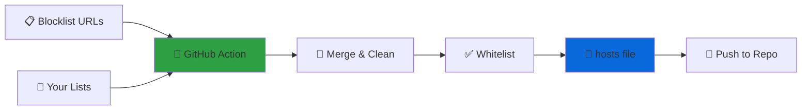

# 👋 ADios — Say Goodbye to Ads

### *The Ultimate Hosts-Based Blocklist. One List. Every Device. Zero Nonsense.*

 

**Block ads on Twitch, Spotify, YouTube, and pretty much everywhere else — using a simple list your computer already understands.**

*No apps to install. No subscriptions. Just copy, paste, and breathe easier.*

<!-- Optional: add a banner image to your repo (e.g. docs/banner.png) and uncomment:

-->

 

---

## 📑 Table of Contents

- [✨ What Is This? (In Plain English)](#-what-is-this-in-plain-english)
- [🔄 How It Works](#-how-it-works)
- [📥 Download & Install (Step by Step)](#-download--install-step-by-step)
- [🛡️ What Gets Blocked](#️-what-gets-blocked)
- [✅ Compatibility](#-compatibility)
- [❓ FAQ](#-faq)
- [🔧 Build It Yourself](#-build-it-yourself)
- [📜 License & Thanks](#-license--thanks)

---

## ✨ What Is This? (In Plain English)

**ADios** is a **giant list of ad and tracker addresses** that your computer can use to **block them before they load**.

- 🧹 **One list** — We merge dozens of trusted blocklists (AdAway, Steven Black, AdGuard, and more) into a single, clean file.
- 🚫 **Whitelist included** — Important stuff (like making Spotify actually play music) is *not* blocked.
- 🔄 **Auto-updated every day** — A robot on GitHub rebuilds the list daily. You get the latest blocks without lifting a finger.
- 📂 **Standard format** — Works with your system **hosts file**, **Pi-hole**, **AdGuard**, **DNSMasq**, and similar tools.

You don’t need to be a nerd. You just need to copy one file to the right place. We’ll show you exactly where.

---

## 🔄 How It Works

```mermaid
flowchart LR
    A[📋 Blocklist URLs] --> B[🔄 GitHub Action]
    C[📄 Your Lists] --> B
    B --> D[🧹 Merge & Clean]
    D --> E[✅ Whitelist]
    E --> F[📁 hosts file]
    F --> G[🚀 Push to Repo]
    style B fill:#2ea043
    style F fill:#0969da
```

| Step | What happens |
|------|----------------|
| 1️⃣ | Every day, GitHub runs a small program that **fetches** all the blocklists we use. |
| 2️⃣ | It **merges** them, **removes duplicates**, and **cleans** the format. |
| 3️⃣ | It **removes** any domain on our whitelist (so Spotify, Twitch, etc. keep working). |
| 4️⃣ | It writes the result into the **hosts** file and **pushes** it to this repo. |
| 5️⃣ | You (or your Pi-hole, etc.) use that **hosts** file. Ads and trackers get blocked. ✨ |

---

## 📥 Download & Install (Step by Step)

### 🪟 Windows

| Step | What to do |
|------|------------|
| **1** | Click this link to open the list: **[Download the hosts file](https://raw.githubusercontent.com/AlexRabbit/ADios/master/hosts)**. |
| **2** | Press `Ctrl + A` to select all, then `Ctrl + C` to copy. |
| **3** | Open **Notepad** *as Administrator* (right‑click Notepad → “Run as administrator”). |
| **4** | Go to **File → Open** and navigate to: `C:\Windows\System32\drivers\etc\` |
| **5** | In the file type dropdown, choose **“All Files (*.*)”** so you can see **hosts**. |
| **6** | Open **hosts**. **Make a backup first** (e.g. copy the file and name it `hosts.backup`). |
| **7** | Scroll to the **bottom** of the file. Paste the copied list there. Save and close. |
| **8** | Clear your browser cache (or restart the browser). Done! 🎉 |

> ⚠️ **Important:** Always keep a backup of your original **hosts** file. If something goes wrong, you can restore it.

### 🍎 macOS / 🐧 Linux

| Step | What to do |
|------|------------|
| **1** | Download: **[hosts file](https://raw.githubusercontent.com/AlexRabbit/ADios/master/hosts)** (right‑click → Save As, or copy the raw content). |
| **2** | Open **Terminal**. Back up your current hosts file: `sudo cp /etc/hosts /etc/hosts.backup` |
| **3** | Append the list to your hosts file (replace with your download path if needed):  
| | `sudo sh -c 'curl -sL https://raw.githubusercontent.com/AlexRabbit/ADios/master/hosts >> /etc/hosts'` |
| **4** | Or manually: open `/etc/hosts` in an editor with sudo, paste at the bottom, save. |
| **5** | Clear browser cache. Done! 🎉 |

---

## 🛡️ What Gets Blocked

| Category | What it means |
|----------|----------------|
| 📺 **Ads & trackers** | Common ad and analytics domains from the included lists. |
| 📡 **Streaming ads** | Twitch, YouTube (e.g. Samsung TV app), and similar ad domains. |
| 🎵 **In‑app ads** | Spotify, Deezer, and other in‑app ad endpoints where possible. |
| 🦠 **Malware & abuse** | Domains from URLhaus and similar abuse lists. |
| 📧 **Scam / spam** | Scam and spam domains from the included sources. |
| 🔞 **Adult ads** | Adult ad networks (not adult content itself). |

Whitelisted domains (e.g. core Spotify/Twitch domains needed for playback) are **removed** from the list so services keep working. ✅

---

## ✅ Compatibility

| Use case | What to use |
|----------|-------------|
| 🪟 **Windows / 🍎 macOS / 🐧 Linux** | [**hosts**](https://raw.githubusercontent.com/AlexRabbit/ADios/master/hosts) — copy into your system hosts file (see [Download & Install](#-download--install-step-by-step)). |
| 🛡️ **AdGuard / AdGuard Home** | Use the **hosts** file URL or import the list; AdGuard supports hosts-style blocklists. |

---

## ❓ FAQ

<b>🔄 How often is the list updated?</b>

**Every day.** A GitHub Action runs at midnight UTC, rebuilds the list from all sources, and pushes the new **hosts** file to this repo. You can re-download or re-pull the list anytime.

<b>🚫 Will this break Spotify / Twitch / YouTube?</b>

We use a **whitelist** so that the domains those services need to work (playback, login, etc.) are *not* blocked. We only block **ad and tracking** domains. If something breaks, you can open an issue and we can add a domain to the whitelist.

<b>📁 Where is my hosts file?</b>

- **Windows:** `C:\Windows\System32\drivers\etc\hosts`  
- **macOS / Linux:** `/etc/hosts`  

Open it with a text editor (as Administrator on Windows, or with `sudo` on macOS/Linux).

<b>🔒 Is this safe?</b>

The list is built from well-known, community-maintained blocklists (AdAway, Steven Black, AdGuard, OISD, etc.). The build runs on GitHub’s servers and the result is plain text. You can inspect the script (`build_hosts.py`) and the source lists (`blacklist.txt`) in this repo.

<b>📥 Do I need to update it myself?</b>

The **file on GitHub** updates automatically every day. To get the latest list on *your* device, you can re-download and replace (or re-append) the hosts file from time to time, or use a tool that pulls the list by URL (e.g. Pi-hole).

---

## 📜 License & Thanks

- **License:** [GPL-3.0](LICENSE). Same for the build script and config; upstream lists keep their respective licenses.
- **Sources:** This list aggregates from public, community-maintained blocklists (AdAway, Steven Black, AdGuard, OISD, FadeMind, URLhaus, and others). See **blacklist.txt** in the repo for the full URL list. We don’t control those projects; we merge, deduplicate, and whitelist.

**Backup hosts file (Windows):** [winhelp2002.mvps.org](http://winhelp2002.mvps.org/defaultwin7-hosts.zip) — keep a clean copy before making changes.

---

**ADios** — *one list, auto-updated, for hosts-based blocking everywhere.*

**👋 ADios, ads.**

